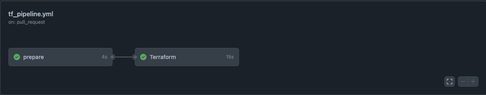

# Build and Deploy Falsk app on AWS Elastic Container Service  (Fargate) using Terraform and GitHub Actions

## - Digram

 

## - Used AWS services 
```
Project: sucounix/xpov/01-infra/infra

 Name                                                                    Monthly Qty  Unit                    Monthly Cost

 aws_dynamodb_table.dynamodb-terraform-state-lock
 ├─ Write capacity unit (WCU)                                                     20  WCU                           $11.58
 ├─ Read capacity unit (RCU)                                                      20  RCU                            $2.32
 ├─ Data storage                                                   Monthly cost depends on usage: $0.31 per GB
 ├─ Point-In-Time Recovery (PITR) backup storage                   Monthly cost depends on usage: $0.24 per GB
 ├─ On-demand backup storage                                       Monthly cost depends on usage: $0.12 per GB
 ├─ Table data restored                                            Monthly cost depends on usage: $0.18 per GB
 └─ Streams read request unit (sRRU)                               Monthly cost depends on usage: $0.000000245 per sRRUs

 module.alb.aws_lb.main
 ├─ Application load balancer                                                    730  hours                         $19.71
 └─ Load balancer capacity units                                   Monthly cost depends on usage: $5.84 per LCU

 module.ecr.aws_ecr_repository.container_name_1
 └─ Storage                                                        Monthly cost depends on usage: $0.10 per GB

 module.ecr.aws_ecr_repository.main
 └─ Storage                                                        Monthly cost depends on usage: $0.10 per GB

 module.ecs.aws_cloudwatch_log_group.main
 ├─ Data ingested                                                  Monthly cost depends on usage: $0.63 per GB
 ├─ Archival Storage                                               Monthly cost depends on usage: $0.0324 per GB
 └─ Insights queries data scanned                                  Monthly cost depends on usage: $0.0063 per GB

 module.ecs.aws_ecs_service.main
 ├─ Per GB per hour                                                                1  GB                             $3.73
 └─ Per vCPU per hour                                                            0.5  CPU                           $16.99

 module.secrets.aws_secretsmanager_secret.application_secrets[0]
 ├─ Secret                                                                         1  months                         $0.40
 └─ API requests                                                   Monthly cost depends on usage: $0.05 per 10k requests

 module.secrets.aws_secretsmanager_secret.application_secrets[10]
 ├─ Secret                                                                         1  months                         $0.40
 └─ API requests                                                   Monthly cost depends on usage: $0.05 per 10k requests

 module.secrets.aws_secretsmanager_secret.application_secrets[11]
 ├─ Secret                                                                         1  months                         $0.40
 └─ API requests                                                   Monthly cost depends on usage: $0.05 per 10k requests

 module.secrets.aws_secretsmanager_secret.application_secrets[1]
 ├─ Secret                                                                         1  months                         $0.40
 └─ API requests                                                   Monthly cost depends on usage: $0.05 per 10k requests

 module.secrets.aws_secretsmanager_secret.application_secrets[2]
 ├─ Secret                                                                         1  months                         $0.40
 └─ API requests                                                   Monthly cost depends on usage: $0.05 per 10k requests

 module.secrets.aws_secretsmanager_secret.application_secrets[3]
 ├─ Secret                                                                         1  months                         $0.40
 └─ API requests                                                   Monthly cost depends on usage: $0.05 per 10k requests

 module.secrets.aws_secretsmanager_secret.application_secrets[4]
 ├─ Secret                                                                         1  months                         $0.40
 └─ API requests                                                   Monthly cost depends on usage: $0.05 per 10k requests

 module.secrets.aws_secretsmanager_secret.application_secrets[5]
 ├─ Secret                                                                         1  months                         $0.40
 └─ API requests                                                   Monthly cost depends on usage: $0.05 per 10k requests

 module.secrets.aws_secretsmanager_secret.application_secrets[6]
 ├─ Secret                                                                         1  months                         $0.40
 └─ API requests                                                   Monthly cost depends on usage: $0.05 per 10k requests

 module.secrets.aws_secretsmanager_secret.application_secrets[7]
 ├─ Secret                                                                         1  months                         $0.40
 └─ API requests                                                   Monthly cost depends on usage: $0.05 per 10k requests

 module.secrets.aws_secretsmanager_secret.application_secrets[8]
 ├─ Secret                                                                         1  months                         $0.40
 └─ API requests                                                   Monthly cost depends on usage: $0.05 per 10k requests

 module.secrets.aws_secretsmanager_secret.application_secrets[9]
 ├─ Secret                                                                         1  months                         $0.40
 └─ API requests                                                   Monthly cost depends on usage: $0.05 per 10k requests

 module.vpc.aws_cloudwatch_log_group.main
 ├─ Data ingested                                                  Monthly cost depends on usage: $0.63 per GB
 ├─ Archival Storage                                               Monthly cost depends on usage: $0.0324 per GB
 └─ Insights queries data scanned                                  Monthly cost depends on usage: $0.0063 per GB

 module.vpc.aws_nat_gateway.main[0]
 ├─ NAT gateway                                                                  730  hours                         $37.96
 └─ Data processed                                                 Monthly cost depends on usage: $0.052 per GB

 module.vpc.aws_nat_gateway.main[1]
 ├─ NAT gateway                                                                  730  hours                         $37.96
 └─ Data processed                                                 Monthly cost depends on usage: $0.052 per GB

 module.vpc.aws_nat_gateway.main[2]
 ├─ NAT gateway                                                                  730  hours                         $37.96
 └─ Data processed                                                 Monthly cost depends on usage: $0.052 per GB

 OVERALL TOTAL                                                                                                     $173.01
──────────────────────────────────
80 cloud resources were detected:
∙ 23 were estimated, 21 of which include usage-based costs, see https://infracost.io/usage-file
∙ 57 were free:
  ∙ 12 x aws_secretsmanager_secret_version
  ∙ 6 x aws_route_table_association
  ∙ 6 x aws_subnet
  ∙ 4 x aws_route
  ∙ 4 x aws_route_table
  ∙ 3 x aws_eip
  ∙ 3 x aws_iam_role
  ∙ 3 x aws_iam_role_policy_attachment
  ∙ 2 x aws_appautoscaling_policy
  ∙ 2 x aws_ecr_lifecycle_policy
  ∙ 2 x aws_iam_policy
  ∙ 2 x aws_security_group
  ∙ 1 x aws_alb_listener
  ∙ 1 x aws_alb_target_group
  ∙ 1 x aws_ecs_cluster
  ∙ 1 x aws_ecs_task_definition
  ∙ 1 x aws_flow_log
  ∙ 1 x aws_iam_role_policy
  ∙ 1 x aws_internet_gateway
  ∙ 1 x aws_vpc

```

## - Infrastructure CI/CD

 
 
 
 

## - Flask-APP CI/CD

 
 
 
 
 
 
 
 

## - APP-P0C

 
 
 
 
 
 
 
 
## URLs

http://xpovii-alb-dev-1720793357.eu-central-1.elb.amazonaws.com/api/docs/

http://xpovii-alb-prod-1384796328.eu-central-1.elb.amazonaws.com/api/docs/
